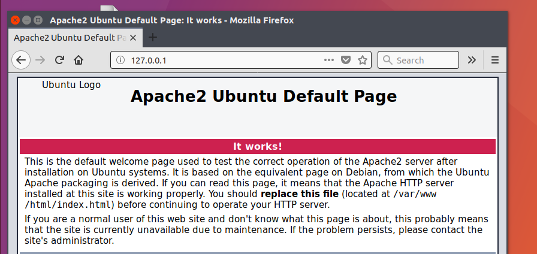
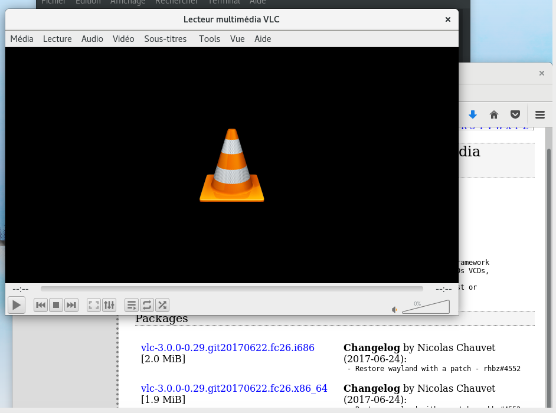
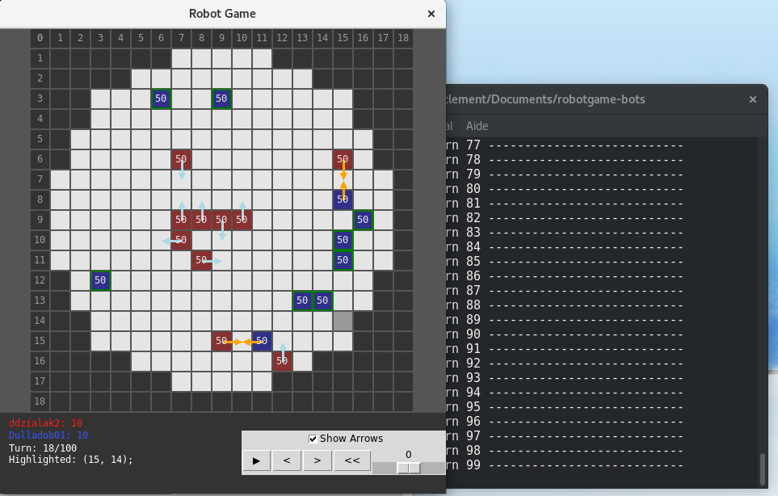

## Homework chapter10

# 1)



# 2)
```bash 
sudo dnf install xeyes
```

# 3)
```bash 
sudo dnf install \ http://download1.rpmfusion.org/free/fedora/rpmfusion-free-release-$(rpm
-E %fedora).noarch.rpm

sudo dnf install \ http://download1.rpmfusion.org/nonfree/fedora/rpmfusion-nonfree-release-$(rpm
-E %fedora).noarch.rpm

dnf --enablerepo=rpmfusion-* install vlc
or
wget  http:
//download1.rpmfusion.org/nonfree/fedora/releases/26/Everything/x86_64/os/repoview/letter_d.
group.html
```



# 4)
```bash 
wget http://download1.rpmfusion.org/nonfree/fedora/releases/26/Everything/x86_64/os/Packages/d/dropbox-2015.10.28-3.fc26.noarch.rpm

dnf install dropbox-2015.10.28-3.fc26.noarch.rpm

```

# 5)
```bash 
apt-get upgrade
```

# 6)
```bash 
do-release-upgrade 
```

# 7)
```bash 
sudo apt edit-sources

deb http://linux-libre.fsfla.org/pub/linux-libre/freesh/ freesh main

wget https://jxself.org/gpg.inc

sudo apt-key add gpg.inc

sudo apt update

sudo apt install linux-libre-4.14 
```

# 8)
```bash
sudo dnf upgrade --refresh

sudo dnf install dnf-plugin-system-upgrade

sudo dnf system-upgrade download --releasever=27

sudo dnf system-upgrade reboot
```

# 9)
To install denyhosts i just followed the instruction and i ran it with python. 

```bash
#installing ipadr dependencie 
dnf install https://rpmfind.net/linux/fedora/linux/releases/27/Everything/x86_64/os/Packages/p/python-ipaddr-2.1.10-7.fc27.noarch.rpm

cp denyhosts.conf /etc

nano /etc/denyhosts.conf

cp daemon-control-dist daemon-control

chmod 700 daemon-control

daemon-control start

python /usr/local/bin/denyhosts --config /etc/denyhosts.conf --daemon

```

# 10)
```bash
pip install rgkit
dnf install python-tkinter
#then i download a git repo with existing robots
git clone https://github.com/mpeterv/robotgame-bots
#then i run the game with the following command
rgrun ddzialak2.py Dulladob01.py

```


# 11)
```bash
git clone https://github.com/jhajek/Linux-text-book-part-1

sudo apt-get install pandoc

sudo add-apt-repository ppa:texlive-backports/ppa

sudo apt-get update

sudo apt-get install texlive texlive-latex-recommended texlive-latex-extra texlive-fonts-recommended texlive-fonts-extra texlive-xetex

#then i add the fonts

wget http://packages.sil.org/sil.gpg

sudo apt-key add sil.gpg

sudo apt-add-repository "deb http://packages.sil.org/
ubuntu/ $(lsb_release -sc) main"

sudo apt-get update

sudo apt-get install fonts-sil-charis

sudo apt-get install fonts-inconsolata

sudo fc-cache -fv

#I open the pdf 

./build-linux.sh
```


# 12)
```bash


dnf --enablerepo=remi install httpd php php-common

#let's start the server
sudo systemctl start httpd.service
```

# 13)
vi /var/www/html/info.php
I have php version 7.1.11


