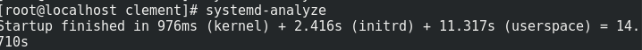
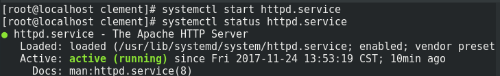
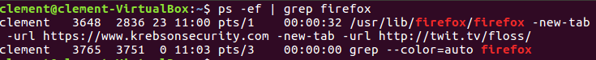
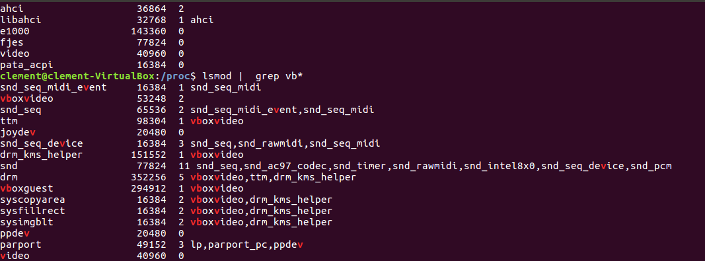
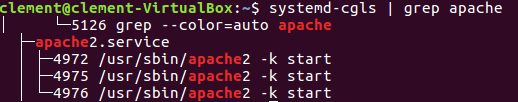
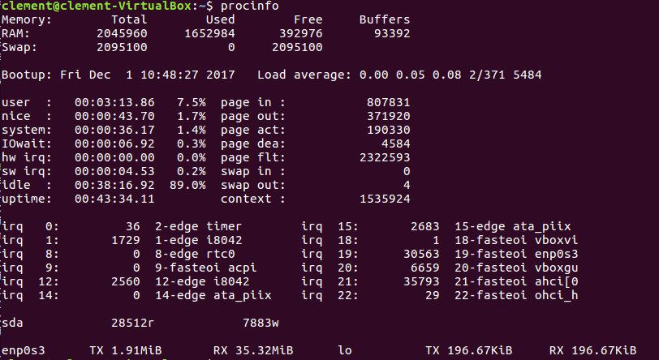
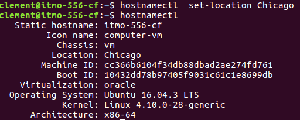
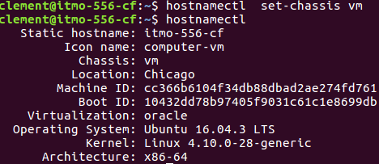

## Homework chapter11

# 1)
First of all i added the following line into /etc/default/grub

```bash 
GRUB_BACKGROUND="/home/clement/desktop/image.png"

#and I change 

GRUB_CMDLINE_LINUX_DEFAULT="quiet splash"
#to
GRUB_CMDLINE_LINUX_DEFAULT=""
#then i run
sudo upgrade-grub

```

# 2)


# 3)
I check the status with : 
```bash 
systemctl status mariadb.service
```
I enable it :
```bash 
systemctl enable mariadb.service
```
and I start it : 
```bash 
systemctl start mariadb.service
```
then reboot:
```bash
systemctl reboot 
```
 
# 4)
There is no difference: 


# 5)

```bash 
systemd-analyze blame
```

 
# 6)
```bash 
systemctl enable httpd.service
systemctl start httpd.service
```



# 7)

```bash 
systemctl kill -s SIGHUP httpd.service

```

# 8)
```bash 
systemctl isolate runlevel3.target

systemctl get-default

systemctl isolate runlevel3.target

```

# 9)
```bash 
sudo systemctl show --property "After"
httpd.service 

sudo systemctl show --property "Wants"
httpd.service 
```

# 10)
The c program is the following one : 
```C
#include <stdio.h>
int main()
{
 int x;

for(x = 0; x < 100; x--)
{
    printf("%d", x);
}
}
```
```bash 
#very important
nice -20 loop.c
#lowest priority
nice 19 loop.c
#display each time the process's usage with 
htop 
```

# 11)

```bash 
firefox -new-tab -url https://www.krebsonsecurity.com
-new-tab -url http://twit.tv/floss/
```

let's find the process IDs:
```bash 
ps -ef | grep firefox
```


let's kill the process now: 

```bash 
kill -2 3648
```

# 12)



# 13)
```bash 
lspci
```

# 14)

```bash 
cat /proc/cpuinfo | grep flags
```

# 15)

```bash 
systemd-cgls | grep apache

systemctl kill -s SIGHUP apache2.service

```

# 16)

```bash 
systemd-cgls | grep apache
```


# 17)




# 18)
```bash 
timedatectl set-ntp 1
```

# 19)
```bash 
hostnamectl set-hostname itmo-556-cf
```







